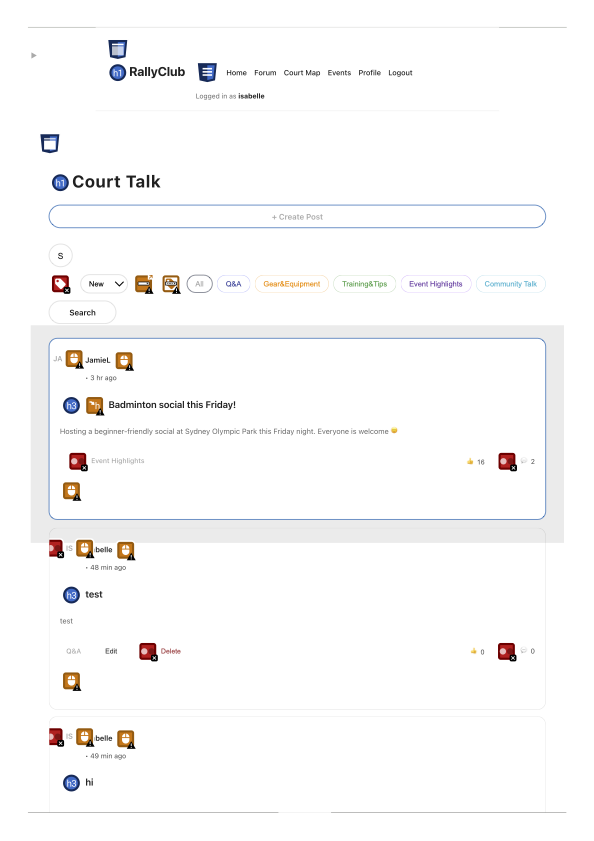
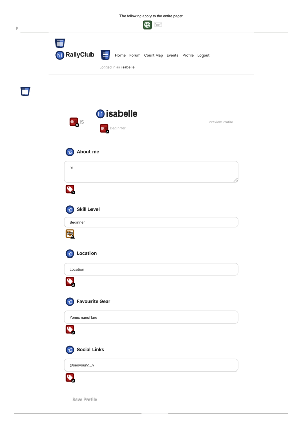

# Looking Back — What RallyClub Actually Became

The hardest part of any project isn't building it. It's looking back at what you built and being honest about how well it actually worked. Throughout this semester, each blog post asked me to justify decisions before they were tested. This one asks something harder: to evaluate whether those decisions held up.

## Performance in Practice

The court map had a noticeable loading delay during use — something user testing confirmed when a participant remarked that connecting to the external venue website took longer than expected. Beyond that, Lighthouse audits across the four core pages gave the clearest technical picture.

The homepage scored 100, which felt earned. After tutors described the original layout as generic, I redesigned it on the final day — adding the skill-matched game card and FAQ to the landing view — and the score reflected that structural improvement. The profile page scoring 78 was the most surprising result given how minimal that page is. Lighthouse flagged unlabelled select elements and contrast failures, which WAVE later confirmed: 4 errors, 3 contrast errors, and an AIM score of 6.4 out of 10. The events page scored 85, with render-blocking requests adding approximately 420ms traced to static image assets loaded directly from the project folder. In production, CDN delivery and image compression would resolve this — within the prototype timeframe, it was a conscious trade-off in favour of completing core functionality first.

## User Experience and Accessibility

Structured testing with two participants who had no prior exposure to the app produced consistent findings and surfaced issues that weren't visible from the inside.

The skill level system was the clearest success. Both participants used the skill filter unprompted and completed the RSVP without assistance. One went straight to intermediate games from the homepage; the other compared the experience to Reddit and Facebook, which wasn't a comparison I expected but felt like genuine external validation of the community-first structure. Skill level matching working intuitively without instruction confirmed the core design decision held up.

Two usability gaps emerged consistently across both sessions. The first was event card affordance: both participants expected the entire card to be clickable and attempted to interact with different areas before realising only the title was a link. The fix is straightforward, but it's the kind of assumption that only becomes visible when you watch someone encounter it for the first time. The second was attendee profile discoverability. Both participants searched for a dedicated members page before eventually locating profiles through the contextual avatar links. Two out of two participants struggling at the same point is a pattern, not an edge case — the context-based profile system works once understood, but the path to understanding it needs to be shorter.

The second session also surfaced smaller friction points: logout button placement felt inconsistent with platform conventions, the site logo wasn't interactive as expected, and forum content felt visually small on desktop. None are critical, but they accumulate and affect how polished the platform feels overall.

The WAVE audit on the forum page was harder to sit with. As shown in Figure 1, it scored 1.7 out of 10 — 60 errors, 60 contrast errors, and 92 alerts. Errors were concentrated on avatar images missing alt text across every post and unlabelled category filter buttons. These issues didn't prevent task completion in either testing session, but they represent a real failure for users relying on assistive technologies. My Week 10 blog planned WAVE, axe DevTools, keyboard-only, and colour blindness testing. In practice, only Lighthouse and WAVE were completed. That gap is something I have to own.

  
  

*Figure 1: WAVE audit results for the Court Talk forum page (left) and profile page (right). The forum scored 1.7 out of 10 with 60 errors and 60 contrast errors; the profile page scored 6.4 out of 10 with more contained issues consistent with the Lighthouse findings.*

## Critical Reflection and Improvement Planning

The mobile responsiveness gap wasn't a planning oversight — it was a communication failure. One teammate was responsible for mobile responsiveness and several event page functions, and I didn't check in closely enough to know things weren't on track. By the time I realised, I could address the event functionality but not the responsive layout. The lesson wasn't that task allocation was wrong — it was that I needed to stay in contact with what everyone was building, even for tasks that weren't mine. The simulated attendee count came from the same blind spot: a gap that could have been caught and fixed with earlier visibility across the team.

The improvements I'd prioritise are all grounded in what testing revealed. The most important is redesigning the events page so skill level is the visual centrepiece rather than a filter dropdown — it's the platform's core differentiator and currently the last thing a user encounters rather than the first. Second is making the full event card clickable, which both participants expected. After that: logo navigation, logout placement, forum sizing on desktop, and distance-based court filtering (suggested by the second participant and genuinely useful for anyone planning around transport). These aren't feature additions — they're the difference between a functional prototype and something that feels considered.

## Retrospective Assessment of Functional Requirements

The forum was listed as a Must Have in Week 6, and testing produced real validation — one participant compared it favourably to Reddit unprompted. But by the end it was clear that event-finding and skill-matching was the actual core of what RallyClub does. If I were rewriting the requirements, I'd frame skill-level event coordination as the primary Must Have and position the forum as what supports it, not the other way around.

User profiles were also listed as a Must Have, but the implementation ended up more minimal than planned. That was deliberate — the platform exists to help people meet in person, not build digital identities, and retaining too much user information felt at odds with that purpose. Testing complicated this: the second participant wanted profile pictures and richer attendee cues, which suggests we may have gone slightly too minimal. A middle ground — lightweight profile pictures without a full social graph — is probably where the next iteration should land, and it's something that should have been written into the requirements rather than resolved through a mid-project pivot.

The mobile audience was acknowledged throughout but never formally scoped. In hindsight that was a requirements gap, not just an execution constraint. Labelling the project desktop-first was accurate, but it allowed mobile responsiveness to become a single person's responsibility rather than a shared commitment. A second audience with different device needs should have had its own requirements from the beginning, even if those were explicitly deprioritised.

---

In Week 6, I asked what problem this app actually solves. Having built and evaluated it, I'd give the same answer — coordination friction — but I understand it more specifically now. The problem isn't just logistics. It's the social anxiety of not knowing who you're playing with or whether you'll fit in. Skill level matching, contextual profiles, and beginner-friendly event visibility are all doing the same underlying work: making it feel safe to show up. That's what both testing sessions confirmed, and it's what I'd keep at the centre of every future development decision.