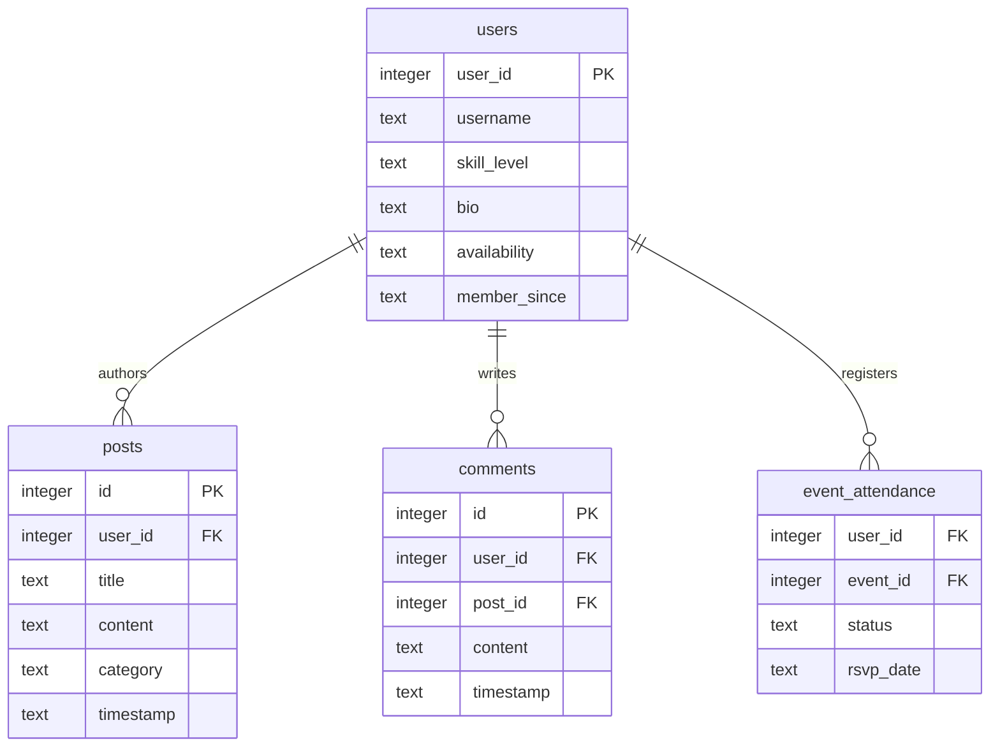

# Profiles Without a Members Tab: How Context Based Profiles Support Coordination Rather Than Networking

One of the more contentious design decisions in this project was removing the Members discovery tab entirely. Players can still access detailed profiles including skill level, activity history, and games attended, but only within specific contexts such as selecting an author's name on a forum post or tapping an attendee avatar within an RSVP modal.

## The Justification: Context Over Browsing

My research suggested that players are not interested in casually browsing member profiles. Instead, they are looking for answers to practical questions during moments of decision making.

- Who is this person giving advice?
- What skill level are the other attendees?
- Can I trust this organiser and event?

By anchoring profiles to these moments, the platform prioritises credibility and reassurance rather than passive browsing. Profiles become functional trust signals rather than social networking tools.

## The Technical Implication: Simpler Data Models

Removing member discovery had a significant impact on the database structure and overall system complexity.

Without profile browsing or social networking features, the application no longer required:
- follower or friend relationships
- member discovery algorithms
- profile ranking systems
- follower lists or engagement metrics

Instead, the `users` table only requires information relevant to coordination and participation.

- `user_id`
- `username`
- `skill_level`
- `bio`
- `availability`
- `member_since`

The user model also maintains direct relationships with:
- `posts`
- `comments`
- `event_attendance`

This keeps the database structure focused and easier to maintain within the project scope.

### Database Architecture Schema (ERD Snippet)

Below is the clean relational setup handling our context-driven profile logic:

## Building Trust Without Social Features

Removing social networking systems does not mean profiles become empty or impersonal. Instead, profiles communicate reliability and experience through lightweight trust indicators.

### Skill Rating

Profiles display a simple skill rating system validated through community moderation rather than algorithmic ranking. This supports transparency without encouraging unhealthy competition.

### Activity Indicators

Users can view information such as games attended, posts created, and comments contributed. These indicators provide evidence of participation and community involvement.

### Membership Duration

Displaying a member since date helps users understand whether someone is new to the platform or already active within the community. Importantly, the design avoids presenting newer members as outsiders.

Together, these signals build trust while avoiding the maintenance burden of a full social graph. The platform is designed to support coordination and participation rather than maximise engagement metrics or time spent on the application.

## Accessibility and Cognitive Load

Removing member discovery also creates accessibility benefits. Fewer navigation options simplify the interface and reduce cognitive load for new users. Profiles only appear when relevant to the current task, allowing users to focus on joining games and interacting with content rather than navigating unnecessary social features.

## Looking Ahead

The next stage of the project will focus on the court map and database schema. The same principle continues to guide these decisions: remove features that are not central to solving the coordination problem.

For example, courts will include practical information such as location, facilities, operating hours, and pricing, but they will not include user review systems. The goal of the platform is to help players organise games efficiently, not to function as a review platform for badminton venues.